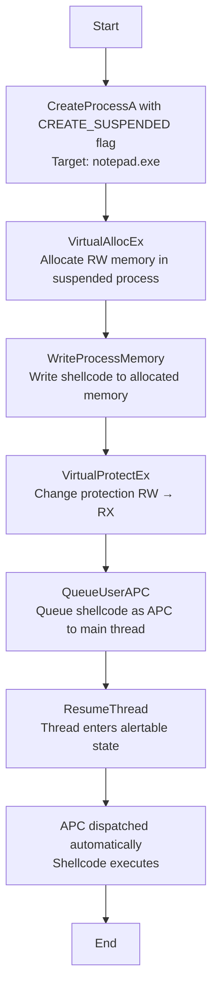
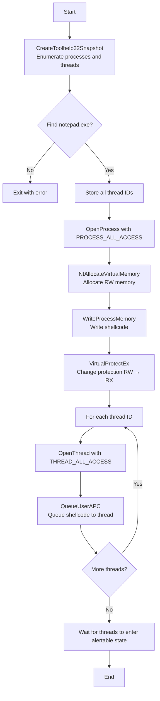

# APC Injection: Asynchronous Procedure Call Queue Hijacking

## Technique

**MITRE ATT&CK:** T1055.004 - Process Injection: Asynchronous Procedure Call

_APC Injection leverages Windows' Asynchronous Procedure Call mechanism to execute shellcode in the context of another process's thread. This technique queues malicious code as an APC function that executes when the target thread enters an alertable state._

## Description

This tool implements two variants of APC injection: **Early Bird** and **Normal APC Injection**. Early Bird creates a new suspended process, injects shellcode, queues it as an APC, then resumes execution. Normal APC Injection targets existing processes by enumerating all threads and queuing the shellcode to each one, waiting for threads to become alertable. Both methods abuse the legitimate APC mechanism to achieve code execution with reduced detection footprint.

## Execution Flow

### Early Bird APC Injection



### Normal APC Injection



## Steps Detail

### Early Bird Variant

| Step | API Call                   | Description                                      |
| ---- | -------------------------- | ------------------------------------------------ |
| 1    | `CreateProcessA`           | Create target process in suspended mode          |
| 2    | `VirtualAllocEx`           | Allocate RW memory in target process             |
| 3    | `WriteProcessMemory`       | Write shellcode to allocated memory              |
| 4    | `VirtualProtectEx`         | Change memory protection from RW to RX           |
| 5    | `QueueUserAPC`             | Queue shellcode as APC function to main thread   |
| 6    | `ResumeThread`             | Resume thread → APC dispatches automatically     |

### Normal APC Variant

| Step | API Call                   | Description                                      |
| ---- | -------------------------- | ------------------------------------------------ |
| 1    | `CreateToolhelp32Snapshot` | Snapshot processes and threads                   |
| 2    | `Process32First/Next`      | Enumerate processes to find target               |
| 3    | `Thread32First/Next`       | Enumerate all threads of target process          |
| 4    | `OpenProcess`              | Open target process with PROCESS_ALL_ACCESS      |
| 5    | `NtAllocateVirtualMemory`  | Allocate RW memory (NT API instead of Win32)     |
| 6    | `WriteProcessMemory`       | Write shellcode to allocated memory              |
| 7    | `VirtualProtectEx`         | Change memory protection from RW to RX           |
| 8    | `OpenThread`               | Open each thread with THREAD_ALL_ACCESS          |
| 9    | `QueueUserAPC`             | Queue shellcode to each thread's APC queue       |

## Payload Requirements

- Format: Raw shellcode (not PE executable)
- Architecture: x64 or x86 (conditional compilation)
- Position-independent: Must be PIC (Position Independent Code)
- Size: Unrestricted (allocated dynamically)
- Self-contained: No external dependencies

## Usage

```
CWLAPCInjection.exe
```

The mode is hardcoded in `main()`:
- **Early Bird**: `wchar_t mode[] = L"earlybird";`
- **Normal APC**: `wchar_t mode[] = L"normal";`

**Note**: For Normal APC mode, target process (notepad.exe) must be running before execution.

## APC Execution Requirements

**Critical**: APC functions only execute when threads enter an **alertable wait state**. This occurs when threads call:

- `SleepEx()` with `bAlertable = TRUE`
- `WaitForSingleObjectEx()` with `bAlertable = TRUE`
- `WaitForMultipleObjectsEx()` with `bAlertable = TRUE`
- `MsgWaitForMultipleObjectsEx()` with `MWMO_ALERTABLE`
- `SignalObjectAndWait()` with `bAlertable = TRUE`

GUI applications frequently enter alertable states for message processing, making them ideal targets.

## IOCs for Detection

- Process creation with `CREATE_SUSPENDED` flag (Early Bird variant)
- Remote memory allocation with RW → RX transition
- Multiple `QueueUserAPC` calls to external process threads
- Cross-process thread access with `THREAD_SET_CONTEXT` rights
- API sequence: OpenProcess → VirtualAllocEx → WriteProcessMemory → VirtualProtectEx → QueueUserAPC
- NT API usage: `NtAllocateVirtualMemory` from non-system process

## Log Sources Coverage

| Data Component                | Log Source                           | Channel/Event                                | Detected?                        |
| ----------------------------- | ------------------------------------ | -------------------------------------------- | -------------------------------- |
| Process Creation (DC0032)     | WinEventLog:Sysmon                   | EventCode=1                                  | Partial (Early Bird only)     |
| Process Access (DC0035)       | WinEventLog:Sysmon                   | EventCode=10                                 | Yes (PROCESS_ALL_ACCESS)      |
| Process Modification (DC0020) | WinEventLog:Sysmon                   | EventCode=8                                  | No (no CreateRemoteThread)    |
| Thread Access (DC0036)        | WinEventLog:Sysmon                   | EventCode=10 (GrantedAccess=THREAD_*)        | Yes                           |
| Module Load (DC0016)          | WinEventLog:Sysmon                   | EventCode=7                                  | No (shellcode, not DLL)       |
| OS API Execution (DC0021)     | etw:Microsoft-Windows-Kernel-Process | VirtualAllocEx, WriteProcessMemory, QueueUserAPC | Yes                       |

## Detection Strategies

1. **Behavioral Analysis**: Monitor for `QueueUserAPC` calls to external process threads
2. **Memory Scanning**: Detect RW → RX memory transitions followed by QueueUserAPC
3. **Process Creation Monitoring**: Flag processes created with `CREATE_SUSPENDED` flag
4. **Thread Context Monitoring**: Alert on cross-process thread manipulation
5. **API Hooking**: Hook `QueueUserAPC` to detect suspicious APC queue modifications

## Advantages vs Limitations

### Advantages
- No remote thread creation (harder to detect than CreateRemoteThread)  
- Leverages legitimate Windows mechanism  
- Works across process boundaries  
- Early Bird has high success rate  

### Limitations
- Requires target thread to enter alertable state  
- Timing unpredictable (Normal APC variant)  
- Creates suspicious process (Early Bird with CREATE_SUSPENDED)  
- Multiple QueueUserAPC calls are noisy (Normal variant)
