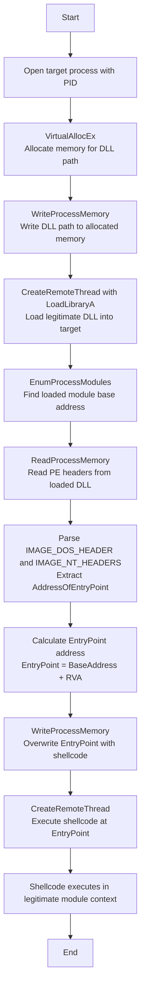

# Module Stomping: DLL Hollowing Injection

## Technique

**MITRE ATT&CK:** T1055.001 - Process Injection: Dynamic-link Library Injection (Module Stomping Variant)

_Note: Module Stomping is an advanced variation of DLL injection where the injected shellcode overwrites the entry point of a legitimate DLL already loaded in the target process, making it harder to detect than traditional DLL injection._

## Description

This tool performs Module Stomping (also known as DLL Hollowing) by loading a legitimate Windows DLL into a target process, then overwriting its entry point with malicious shellcode. The shellcode executes within the memory space of a trusted module, evading memory scanners that only flag suspicious private allocations. The technique leverages the fact that legitimate DLLs are whitelisted by most security tools, providing stealth through trusted module context.

## Execution Flow



### Steps Detail

| Step | API Call                          | Description                                          |
| ---- | --------------------------------- | ---------------------------------------------------- |
| 1    | `OpenProcess`                     | Open target process with PROCESS_ALL_ACCESS          |
| 2    | `VirtualAllocEx`                  | Allocate memory for DLL path string                  |
| 3    | `WriteProcessMemory`              | Write legitimate DLL path to allocated memory        |
| 4    | `GetProcAddress` + `LoadLibraryA` | Get LoadLibraryA address for remote thread           |
| 5    | `CreateRemoteThread`              | Execute LoadLibraryA to load DLL into target process |
| 6    | `EnumProcessModules`              | Enumerate all modules to find loaded DLL             |
| 7    | `GetModuleFileNameEx`             | Verify DLL name matches target DLL                   |
| 8    | `ReadProcessMemory`               | Read PE headers (0x1000 bytes) from DLL              |
| 9    | Parse PE Headers                  | Extract EntryPoint RVA from OptionalHeader           |
| 10   | `WriteProcessMemory`              | Overwrite EntryPoint with shellcode payload          |
| 11   | `CreateRemoteThread`              | Execute shellcode at EntryPoint address              |

## Payload Requirements

- Format: Raw shellcode (not PE executable)
- Architecture: x64 or x86 (conditional compilation)
- Position-independent: Must be PIC (Position Independent Code)
- Size: Must fit within DLL entry point function space
- Self-contained: No external dependencies

## Module Requirements

- DLL must be present at specified path:
  - x64: `C:\temp\modules\64\filemgmt.dll`
  - x86: `C:\temp\modules\86\filemgmt.dll`
- Must be a legitimate Windows system DLL
- Should not have critical functionality at entry point

## Usage

```
CWLModuleStomping.exe <target_pid>
```

**Example:**
```
CWLModuleStomping.exe 1234
```

## IOCs for Detection

- Loading of uncommon system DLLs (e.g., `filemgmt.dll`) in unexpected processes
- Remote thread creation targeting module entry points
- Memory writes to loaded module memory regions (not common behavior)
- Multiple remote threads created in short succession
- API sequence: VirtualAllocEx → WriteProcessMemory → CreateRemoteThread (LoadLibrary) → WriteProcessMemory → CreateRemoteThread (Execute)
- Modification of executable memory within loaded module regions

## Log Sources Coverage

| Data Component                | Log Source                           | Channel/Event                                | Detected?                               |
| ----------------------------- | ------------------------------------ | -------------------------------------------- | --------------------------------------- |
| Process Access (DC0035)       | WinEventLog:Sysmon                   | EventCode=10                                 | ✅ Yes (PROCESS_ALL_ACCESS)             |
| Process Modification (DC0020) | WinEventLog:Sysmon                   | EventCode=8                                  | ✅ Yes (CreateRemoteThread x2)          |
| Module Load (DC0016)          | WinEventLog:Sysmon                   | EventCode=7                                  | ✅ Yes (LoadLibrary)                    |
| OS API Execution (DC0021)     | etw:Microsoft-Windows-Kernel-Process | VirtualAllocEx, WriteProcessMemory           | ✅ Yes                                  |
| Image Load (DC0011)           | WinEventLog:Sysmon                   | EventCode=7                                  | ⚠️ Partial (shows legitimate DLL)       |

## Detection Strategies

1. **Behavioral Analysis**: Monitor for processes loading unusual system DLLs followed by remote thread creation
2. **Memory Scanning**: Scan loaded module memory regions for known shellcode patterns or anomalous code
3. **API Hooking**: Hook `WriteProcessMemory` to detect writes to module memory regions
4. **Entry Point Integrity**: Monitor DLL entry points for modifications post-load
5. **Thread Stack Analysis**: Inspect thread start addresses pointing to module entry points without corresponding legitimate calls
