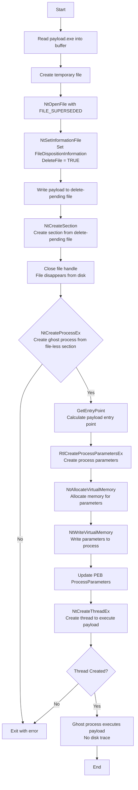

# Process Ghosting: File-less Section Process Injection

## Technique

**MITRE ATT&CK:** T1055 - Process Injection (Process Ghosting Variant)

_Note: Process Ghosting creates a "ghost" process from a memory section that was created from a delete-pending file. Once the file handle is closed, the file disappears from disk, but the section remains valid, allowing process creation from a file-less section._

## Description

This tool creates a "ghost" process by leveraging the delete-pending file state in Windows. The payload is written to a temporary file that is immediately marked for deletion, a memory section is created from this delete-pending file, and then the file handle is closed (causing the file to disappear from disk). A process is spawned from this file-less section, resulting in a process with no on-disk executable image, evading file-based detection mechanisms.

## Execution Flow



### Steps Detail

| Step | API Call                       | Description                                              |
| ---- | ------------------------------ | -------------------------------------------------------- |
| 1    | `CreateFile` / `ReadFile`      | Read payload EXE from file into memory buffer            |
| 2    | `GetTempFileNameW`             | Generate temporary file path                             |
| 3    | `NtOpenFile`                   | Open/create file with FILE_SUPERSEDED flag               |
| 4    | `NtSetInformationFile`         | Set FileDispositionInformation to mark file for deletion |
| 5    | `WriteFile`                    | Write payload to delete-pending file                     |
| 6    | `NtCreateSection`              | Create memory section from delete-pending file           |
| 7    | `CloseHandle`                  | Close file handle (file disappears from disk)            |
| 8    | `NtCreateProcessEx`            | Create ghost process from file-less section              |
| 9    | `NtQueryInformationProcess`    | Get process basic information and PEB address            |
| 10   | `RtlImageNtHeader`             | Parse PE header to get entry point                       |
| 11   | `RtlCreateProcessParametersEx` | Create process parameters structure                      |
| 12   | `NtAllocateVirtualMemory`      | Allocate memory for process parameters                   |
| 13   | `NtWriteVirtualMemory`         | Write process parameters to target process               |
| 14   | `WriteProcessMemory`           | Update PEB.ProcessParameters pointer                     |
| 15   | `NtCreateThreadEx`             | Create thread to execute payload at entry point          |

## Payload Requirements

- Format: Portable Executable (.exe), not raw shellcode
- Architecture: x64
- Position-independent: No hard-coded addresses
- Entry point: Standard PE entry point
- Self-contained: No external dependencies
- **Note:** Payloads requiring console handles (e.g., reverse shells) may need to allocate console manually using `AllocConsole()`

## Usage

```
CWLProcessGhosting.exe
```

(Note: Payload must be placed at `C:\temp\payload64.exe` before execution)

## IOCs for Detection

- Process creation from memory section with no ImagePath on disk
- File operations followed by immediate deletion (delete-pending state)
- Cross-process memory allocation with `NtAllocateVirtualMemory`
- Thread creation pointing to executable memory from section
- API sequence: NtOpenFile → NtSetInformationFile → NtCreateSection → NtCreateProcessEx → NtCreateThreadEx
- Process masquerading as legitimate executable (e.g., svchost.exe) in process parameters

## Log Sources Coverage

| Data Component                | Log Source                           | Channel/Event                                                        | Detected?                     |
| ----------------------------- | ------------------------------------ | -------------------------------------------------------------------- | ----------------------------- |
| Process Creation (DC0032)     | WinEventLog:Sysmon                   | EventCode=1                                                          | ❌ No (ghost process)         |
| Process Access (DC0035)       | WinEventLog:Sysmon                   | EventCode=10                                                         | ✅ Yes                        |
| Process Modification (DC0020) | WinEventLog:Sysmon                   | EventCode=8                                                          | ❌ No (no CreateRemoteThread) |
| Module Load (DC0016)          | WinEventLog:Sysmon                   | EventCode=7                                                          | ❌ No (EXE payload)           |
| OS API Execution (DC0021)     | etw:Microsoft-Windows-Kernel-Process | NtOpenFile, NtSetInformationFile, NtCreateSection, NtCreateProcessEx | ✅ Yes                        |
| File Deletion (DC0040)        | WinEventLog:Sysmon                   | EventCode=23                                                         | ⚠️ Partial (delete-pending)   |

## Key Differences from Herpaderping

- **File State:** ProcessGhosting uses delete-pending files, Herpaderping uses normal temp files
- **File Lifecycle:** ProcessGhosting file disappears before process creation, Herpaderping modifies file after process creation
- **Section Source:** ProcessGhosting creates section from delete-pending file, Herpaderping creates section from normal file
- **Anti-Forensics:** ProcessGhosting removes file from disk before execution, Herpaderping modifies file after section creation
